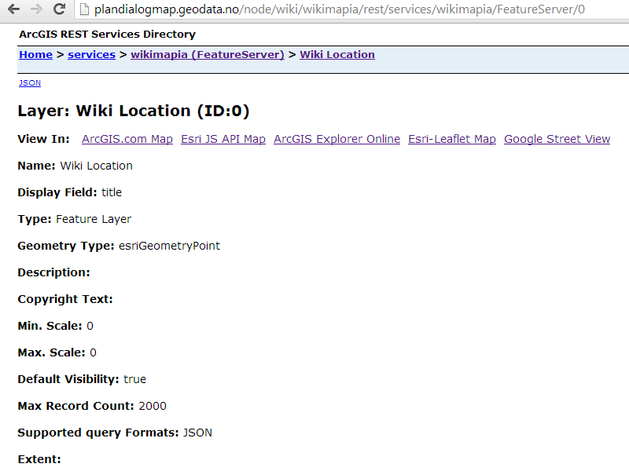
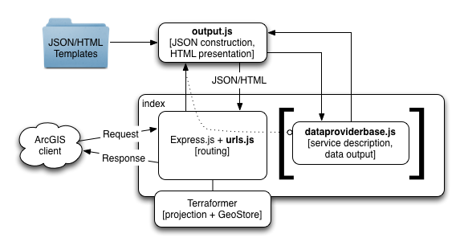

WikiArcNodeJS
========================

This is a [node.js](http://nodejs.org) implementation of the [ArcGIS REST API](http://resources.arcgis.com/en/help/arcgis-rest-api/).

It allows simple read-only access by ArcGIS tools, apps, and APIs, including [ArcGIS Runtime SDKs](https://developers.arcgis.com/en/documentation/) (iOS, Android, Mac OS X, Windows Phone, etc.), [ArcGIS API for JavaScript](https://developers.arcgis.com/en/javascript/), [esri-leaflet](http://esri.github.io/esri-leaflet/), [ArcGIS Desktop](http://www.esri.com/software/arcgis/arcgis-for-desktop) etc.

It also provides HTML to let users browse available services and view them in maps.

View a [live demo](http://www.arcgis.com/home/item.html?id=44b38d1abb514587a552ffd37e18a9af).

##Introduction
The application handles ArcGIS REST API requests to custom "data providers", and returns their output in ArcGIS JSON format.

Here is the data provider:

* **WikiArcNodeJS**: Provide data from http://wikimapia.org/.

The framework lets you build your own "data providers", again a concept which originated from the project Koop.

1. Subclass `dataproviderbase.DataProviderBase`. Override only what you need to.
2. Add instances of your subclass to the `dataProviders` array in `index.js`.

At a glance, this is how it works:

* **urls**: Construct Adaptor and Template REST Endpoints.
* **output**: Construct JSON output. Format HTML output for JSON.
* **dataproviderbase**: Describe the service (fields, idField, nameField, etc.) and return features when requested. Inherit from this and selectively override to add a data provider. It also provides an in-memory `GeoStore` caching framework which data providers may opt in to.

By using the Esri [Terraformer](https://github.com/esri/terraformer) library's `GeoStore` component, the application is able to support spatial caching and indexing for data providers. Terraformer also provides outputting in [geoJSON](http://www.geojson.org/geojson-spec.html) by specifying `f=geojson`.

**Note:** This project is very much a proof of concept on how to implement the ArcGIS REST API using the wikimapia API. Some of the concepts has been borrowed from the GitHub projects node-geoservices-adapter & Koop.

## Requirements
* [node.js](http://nodejs.org)
* [mongodb](http://www.mongodb.org)

##Installation
1. Clone the repo and run `npm update` in the repo folder
2. Run the node server with `node index`
3. Browse to [http://localhost:1337](http://localhost:1337)

##Sample Data Providers
###WikiMapia
WikiMapia is an amazing source for free available POI's and pooling the results like this greatly enhances the value of the data.
Wikimapia provides a REST API, which can be queried based on the geometry(envelope in my case) and exported as json.
But, there is a limit set on the number of request that can be performed. For development purposes, teh limit is 100 request in a span of 5 minutes.

##Known Limitations
* Only a limited subset of the [Geoservices REST Specification](http://resources.arcgis.com/en/help/arcgis-rest-api/) is implemented.
	* [`Server Info`](http://resources.arcgis.com/en/help/arcgis-rest-api/#/Server_Info/02r300000116000000/)
	* [`Catalog`](http://resources.arcgis.com/en/help/arcgis-rest-api/#/Catalog/02r3000000tn000000/)
	* [`Feature Service`](http://resources.arcgis.com/en/help/arcgis-rest-api/#/Feature_Service/02r3000000z2000000/)
	* `Layers (Feature Service)`
	* [`Layer (Feature Service)`](http://resources.arcgis.com/en/help/arcgis-rest-api/#/Layer/02r3000000w6000000/)
	* [`Query (Feature Service\Layer)`](http://resources.arcgis.com/en/help/arcgis-rest-api/#/Query_Feature_Service_Layer/02r3000000r1000000/) by geometry envelope only.
* Only spatial references 4326 and 102100 are supported.
* The application will convert from 4326 to 102100 only.
* Queries only work against the layer end point. `Query (Feature Service)` is declared as a capability but not yet implemented.
* HTML Browsing is not available for Query endpoints. All queries return JSON.
* Only a subset of [`Query (Feature Service\Layer)`](http://resources.arcgis.com/en/help/arcgis-rest-api/#/Query_Feature_Service_Layer/02r3000000r1000000/) is implemented:
	* `objectIds`
	* `outSR` (4326 and 102100 only)
	* `returnIdsOnly`
	* `returnCountOnly`
* Authentication and tokenization is not implemented. All services are considered public, since the data is publically available.

## Resources

* [ArcGIS REST Specification](http://resources.arcgis.com/en/help/arcgis-rest-api/)
* [Terraformer](https://github.com/esri/terraformer) by [Esri](http://esri.github.io)
* [node.js documentation](http://nodejs.org/api/)
* [express.js documentation](http://expressjs.com/api.html)
* [geoJSON Specification](http://www.geojson.org/geojson-spec.html)

## Issues

Find a bug or want to request a new feature?  Please let us know by submitting an Issue.

## Contributing

Anyone and everyone is welcome to contribute. 

## TODO
* [MongoDB]Remove the hardcoding for the collection name, currently only supports "wikilocation" as the collection name.
* [MongoDB]Optimize the mongodb to have a reader and a writer connection to optimize the read and write.

## Licensing
Copyright 2013 Esri

Licensed under the Apache License, Version 2.0 (the "License");
you may not use this file except in compliance with the License.
You may obtain a copy of the License at

   http://www.apache.org/licenses/LICENSE-2.0

Unless required by applicable law or agreed to in writing, software
distributed under the License is distributed on an "AS IS" BASIS,
WITHOUT WARRANTIES OR CONDITIONS OF ANY KIND, either express or implied.
See the License for the specific language governing permissions and
limitations under the License.

